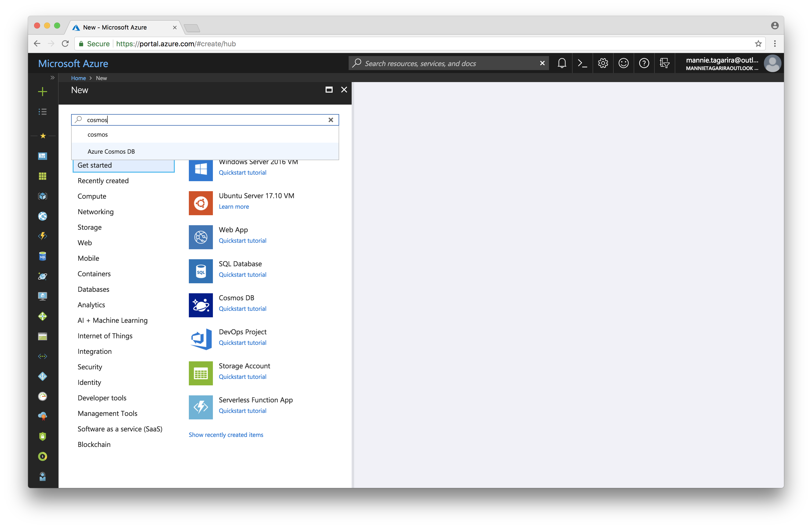
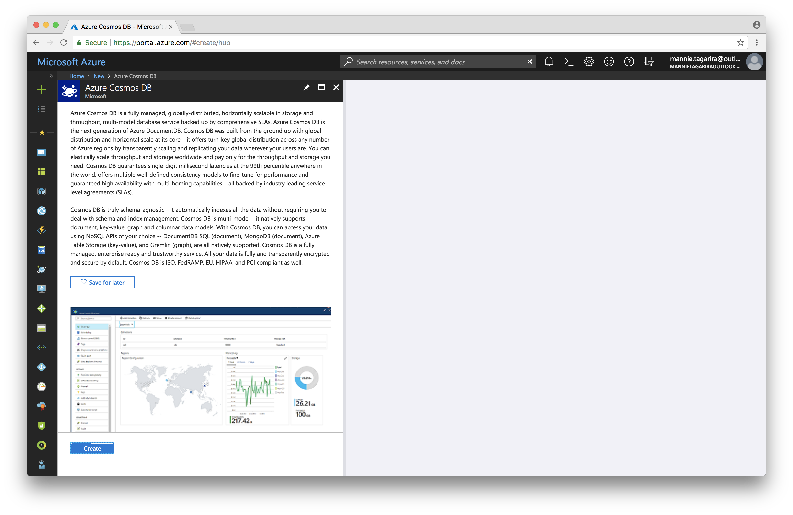
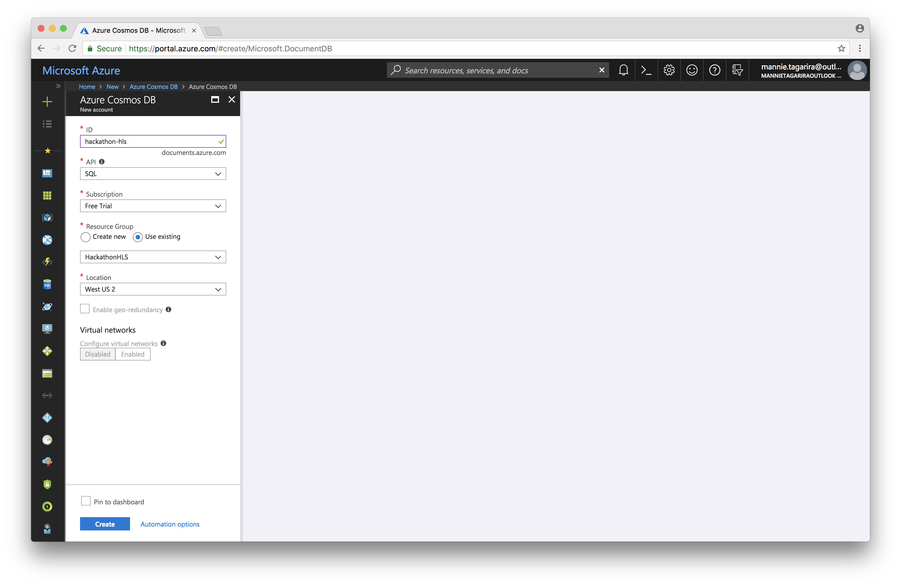
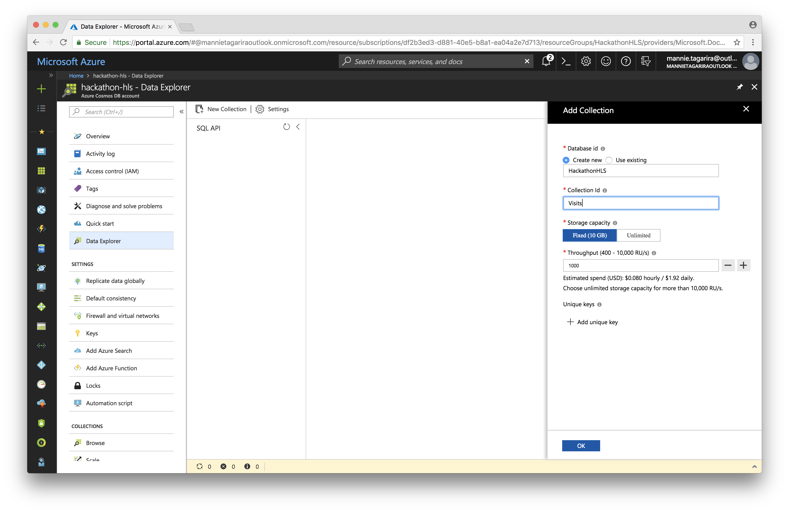

# Cosmos DB

Azure Cosmos DB was built from the ground up with global distribution and horizontal scale at its core. It offers turnkey global distribution with multi-master support across any number of Azure regions by transparently scaling and replicating your data wherever your users are. Elastically scale throughput and storage worldwide, and pay only for what you need. Azure Cosmos DB provides native support for NoSQL choices, offers multiple well-defined consistency models, guarantees single-digit-millisecond latencies at the 99th percentile, and guarantees high availability with multi-homing capabilities and low latencies anywhere in the world— all backed by industry-leading, comprehensive service level agreements (SLAs).

Learn more about [Cosmos DB](https://azure.microsoft.com/en-us/services/cosmos-db/) by reading the [documentation](https://docs.microsoft.com/en-us/azure/cosmos-db/).

---

1. Click on _Create a resource_ and search for _Azure Cosmos DB_.

1. Click _Create_ to navigate to the page to configure your Cosmos DB instance.

1. Enter an _ID_ for your Cosmos DB. Be sure to select _SQL_ as the _API_, and reuse the _Resource Group_ from prior steps.

1. Once the database has been created, navigate to _Data Explorer_ and click _New Collection_. This will open a form asking for a an _ID_ for the new database and another for the collection. This collection is what we will be using to hold the data in later parts of the workshop.

